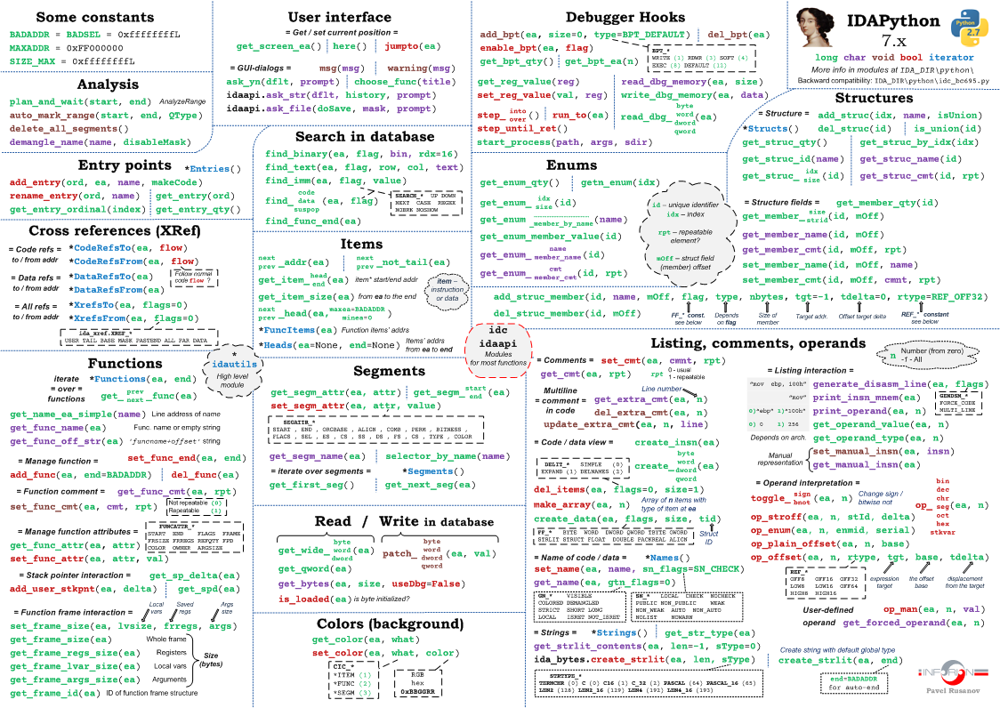

# idapython-cheatsheet

Cheatsheets and example scripts for IDAPython (7.x and 6.x).

It looks like this:

## Printable versions

### PDF
- [English (IDA 6.x and 7.x)](https://github.com/inforion/idapython-cheatsheet/releases/download/pdf/IDAPython_cheat_sheet_.6x_7x._ENG.pdf)
- [Russian (IDA 6.x and 7.x)](https://github.com/inforion/idapython-cheatsheet/releases/download/pdf/IDAPython_cheat_sheet_.6x_7x._RUS.pdf)

### IDAPython 7.x (PNG)

- [IDAPython 7.x cheatsheet (English)](https://github.com/inforion/idapython-cheatsheet/releases/download/7.x/IDAPython-7.x_cheatsheet_print_en.png)
- [IDAPython 7.x cheatsheet (Russian)](https://github.com/inforion/idapython-cheatsheet/releases/download/7.x/IDAPython-7.x_cheatsheet_print_ru.png)

### IDAPython 6.x (PNG)

- [IDAPython 6.x cheatsheet (English)](https://github.com/inforion/idapython-cheatsheet/releases/download/v1.0/IDAPython_cheatsheet_print_en.png)
- [IDAPython 6.x cheatsheet (Russian)](https://github.com/inforion/idapython-cheatsheet/releases/download/v1.0/IDAPython_cheatsheet_print_ru.png)

## Tips & triks & examples

### Debugger Hooks
- Work with breakpoints [source code](https://github.com/inforion/idapython-cheatsheet/blob/master/debugger_hooks/breakpoints.py)

### Listing 
- Simple transformations in disassembler view [source code](https://github.com/inforion/idapython-cheatsheet/blob/master/listing/disasm_transform.py) 
- Make comment to function, using it's argument [source code](https://github.com/inforion/idapython-cheatsheet/blob/master/listing/function_arguments.py) 

### Miscellaneous
- Parsing Global Descriptor Table (GDT, x86) [source code](https://github.com/inforion/idapython-cheatsheet/blob/master/misc/parse_gdt.py)
- Parsing Interrupt Descriptor Table (IDT, x86) [source code](https://github.com/inforion/idapython-cheatsheet/blob/master/misc/parse_idt.py)

## Links

- ["The Beginner's Guide to IDAPython" by Alexander Hanel](https://leanpub.com/IDAPython-Book)
  